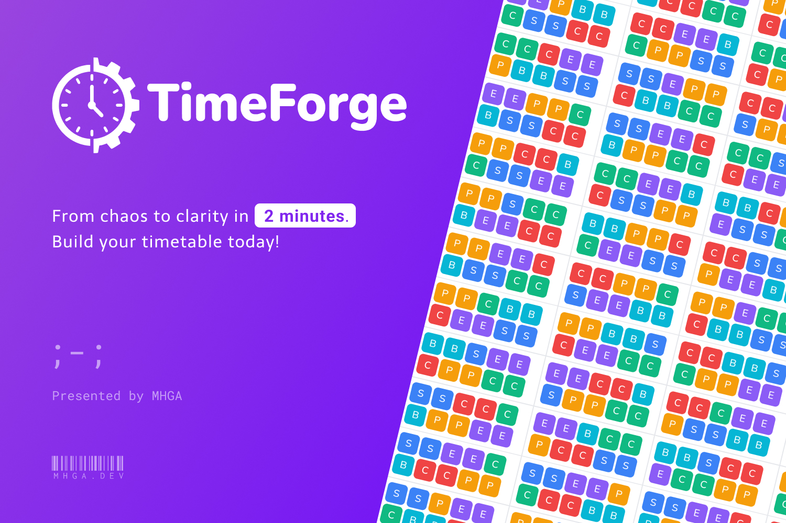

<div align="center">
  <h1>TimeForge</h1>
  
  <br />
  <br />
	
	
	
	
	
	
	
	
	
</div>
<div align="center">
	<h6>Brought to you by <a href="https://mhga.dev">MHGA</a></h6>
</div>

## Try it Out!

**[Demo Link!](https://timeforge.mhga.dev)**

(credentials are pre-filled!)

## System Overview

TimeForge is a comprehensive, automated school timetable management and generation system. It streamlines the complex process of scheduling classes, teachers, and resources through a structured, step-by-step wizard interface. The system leverages advanced constraint programming (via Google OR-Tools) to generate optimized schedules that respect numerous constraints such as teacher availability, room capacity, and curriculum requirements.

## Technology Stack

TimeForge leverages a cutting-edge, high-performance technology stack designed for scalability and user experience.

### Core Runtime
-   **[Bun](https://bun.sh/)**: A fast all-in-one JavaScript runtime, bundler, transpiler, and package manager. Used for both backend execution and project-wide dependency management.

### Frontend Application
Built with performance and accessibility in mind.
-   **[React 19](https://react.dev/)**: The latest version of the library for web and native user interfaces.
-   **[Vite 7](https://vitejs.dev/)**: Next Generation Frontend Tooling for lightning-fast HMR and building.
-   **[TypeScript 5.9](https://www.typescriptlang.org/)**: Strongly typed JavaScript for robust application development.
-   **[Tailwind CSS 4](https://tailwindcss.com/)**: Utility-first CSS framework for rapid UI development.
-   **[shadcn/ui](https://ui.shadcn.com/)** & **[Radix UI](https://www.radix-ui.com/)**: A collection of re-usable components built using Radix UI primitives and Tailwind CSS.
-   **[React Router 7](https://reactrouter.com/)**: Client-side routing.
-   **[React Hook Form](https://react-hook-form.com/)**: Performant, flexible and extensible forms with easy-to-use validation.
-   **[Recharts](https://recharts.org/)**: Redefined chart library setup with React and D3.
-   **[i18next](https://www.i18next.com/)**: Internationalization framework for React.
-   **[Anime.js](https://animejs.com/)**: Lightweight JavaScript animation library.
-   **[Lucide React](https://lucide.dev/)**: Beautiful & consistent icon toolkit.
-   **[Vaul](https://vaul.emilkowal.ski/)**: Drawer component for React.
-   **[Sonner](https://sonner.emilkowal.ski/)**: An opinionated toast component for React.

### Backend API
A robust Express server handling business logic and data orchestration.
-   **[Express.js 5](https://expressjs.com/)**: Fast, unopinionated, minimalist web framework for Node.js (running on Bun).
-   **[PocketBase](https://pocketbase.io/)**: Open Source Backend for your next SaaS and Mobile app in 1 file. Used as the primary database (SQLite), authentication provider, and realtime visualization engine.
-   **[Nodemon](https://nodemon.io/)**: Monitor for any changes in your source and automatically restart your server.

### Optimization Engine
The "Brain" of the scheduling system.
-   **[Python 3](https://www.python.org/)**: The programming language used for the solver scripts.
-   **[Google OR-Tools](https://developers.google.com/optimization)**: An award-winning open source software suite for combinatorial optimization, which solves the timetabling constraints (CP-SAT/MIP).

### Utilities
-   **[SheetJS (xlsx)](https://sheetjs.com/)**: Spreadsheet data parser and writer.
-   **[jsPDF](https://github.com/parallax/jsPDF)**: PDF generation for Client-side.
-   **[html2canvas](https://html2canvas.hertzen.com/)**: Screenshots with JavaScript.

### Comparison

| Feature | Legacy School Software | Excel / DIY | TimeForge |
| :--- | :--- | :--- | :--- |
| **Interface** | Windows 95/XP style, clunky | Manual Grid | Modern Web, Soft UI, Animated |
| **Scheduling** | Heuristic (often suboptimal) | Manual (Prone to errors) | **Mathematical Optimization (OR-Tools)** |
| **Setup** | Complex Enterprise Install | Individual Files | Single Command (`bun dev`), Portable |
| **Tech Stack** | Java / .NET / PHP | VBA Macros | React 19 / Bun / Python |
| **Cost Model** | Expensive Licensing | Free but high labor cost | Open Source / Self-Hostable |


## Prerequisites

Before setting up the project, ensure you have the following installed on your system:

-   **[Bun](https://bun.sh/)** (v1.0.0 or later): The JavaScript runtime used for the backend and package management.
-   **[Python 3](https://www.python.org/)** (v3.11 or later): Required for the optimization engine (OR-Tools).
-   **Operating System**: Linux or macOS is recommended. Windows users should use WSL2 to run automated bash script.

## Getting Started

Follow these steps to set up the development environment:

### 1. Install Dependencies

Navigate to the project root and install the dependencies for the monorepo (frontend, backend, and root):

```bash
bun install
```

### 2. Initialize System

Run the initialization script. This critical step checks for the PocketBase executable (and downloads it if missing or corrupted) and sets up the Python virtual environment for the scheduler engine.

```bash
bun run init
```

*Note: This script will automatically create a `venv` in `backend/src/or-tools` and install the required `ortools` Python package.*

### 3. Start Application

Launch the full stack (Frontend, Backend, and PocketBase) concurrently:

```bash
bun dev
```

The services will be available at:
-   **Frontend Application**: [http://localhost:3000](http://localhost:3000)
-   **Backend API**: [http://localhost:3001](http://localhost:3001)
-   **PocketBase Admin UI**: [http://127.0.0.1:8090/_/](http://127.0.0.1:8090/_/)

## Project Structure

The codebase is organized as a monorepo:

-   **/frontend**: The Client-side React application.
    -   `src/components`: UI components (shadcn/ui) and layout elements.
    -   `src/features`: Logic for specific domains (Time Grid, Assignments, etc.).
    -   `src/routes`: Route definitions and page components.
    -   `src/lib`: Utility functions and global configurations.
-   **/backend**: The Server-side Express application.
    -   `pocketbase/`: Contains the PocketBase executable, database data (`pb_data`), and migrations (`pb_migrations`).
    -   `src/routes`: API endpoints corresponding to frontend features.
    -   `src/or-tools`: Python scripts and constraints for the timetable generation engine.
    -   `src/lib`: Shared utilities and PocketBase client setup.

## Key Features

-   **7-Step Configuration Wizard**: A guided workflow prevents errors by enforcing a logical setup order (Time Grid -> Resources -> Curriculum -> Classes -> Assignments -> Generation).
-   **Visual Time Grid Editor**: Interactive drag-and-drop interface for defining school days, period durations, and breaks.
-   **Resource Management**: CRUD operations for Subjects, Teachers, and Rooms with validation.
-   **Automated Scheduling**: Integration with Google OR-Tools to solve the complex constraint satisfaction problem of timetabling.
-   **Real-time Validation**: Immediate feedback on rule violations.
-   **Data Export**: Complete export functionality for finalized timetables, including Excel and PDF for easy printing.

## License

Private Project.
